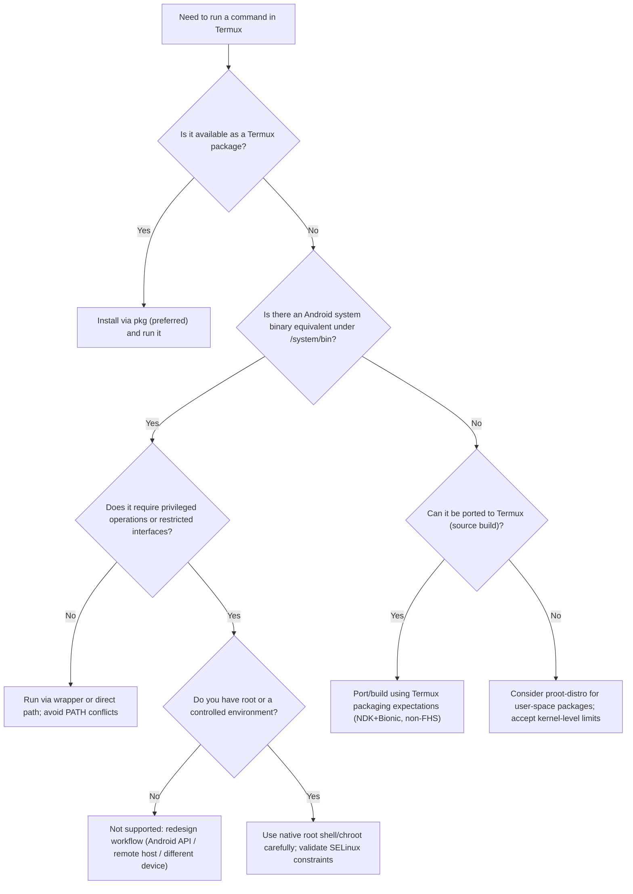
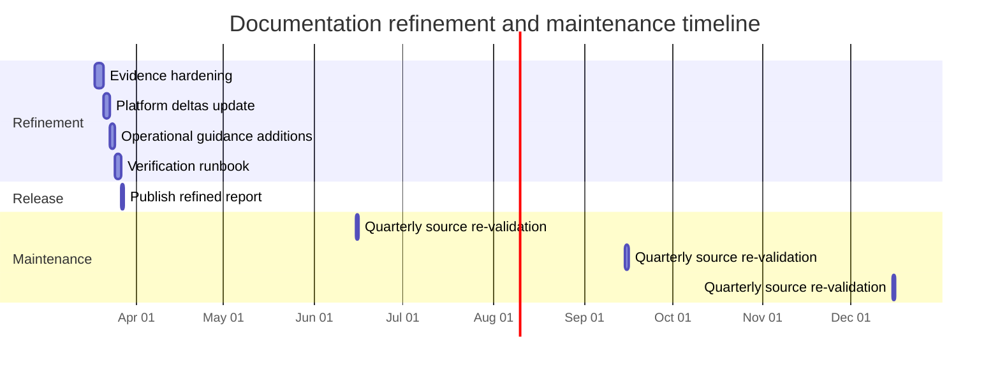

# android-linux-01

Scripts to start/stop Ubuntu (proot-distro) with XFCE4 desktop + RDP access inside **Termux** + **Termux:X11** on Android.

---

## Scripts

| Script | Where to run | When to run |
|---|---|---|
| `setup.sh` | Termux | **Once only** — installs xfce4, TigerVNC, xrdp |
| `start.sh` | Termux | Every time you want to start the desktop |
| `stop.sh` | Termux | Before turning off the desktop |

---

## First-time setup

> Run **once** in Termux. No sudo needed — everything installs via `pkg`.

```bash
bash setup.sh
```

This will:
- `pkg install` xfce4, xfce4-goodies, tigervnc, xrdp, pulseaudio, dbus
- Write `~/.vnc/xstartup` (launches XFCE4 via VNC)
- Write `$PREFIX/etc/xrdp/xrdp.ini` (VNC backend on port 5901)
- Prompt you to set a **VNC password** — this is what you enter in the RDP login screen

---

## Daily usage

### Start desktop + RDP
```bash
bash start.sh
```
This starts in order:
1. PulseAudio (audio)
2. TigerVNC on display `:1` — used as the xRDP backend
3. `xrdp-sesman` + `xrdp` — RDP listener on port **3389**
4. Termux:X11 on display `:0` — for local view on phone
5. XFCE4 on the local display

### Connect via RDP (from PC / another device)
- Your phone's Wi-Fi IP is printed by `start.sh`. Or find it with:
  ```bash
  ip addr show wlan0 | grep 'inet '
  ```
- Open any RDP client and connect to: `<phone-ip>:3389`
- At the login screen: enter any username, and the **VNC password** set in `setup.sh`

### View locally on phone
- Open the **Termux:X11** app on your phone.

### Stop desktop
```bash
bash stop.sh
```

---

## Requirements
- [Termux](https://f-droid.org/repo/com.termux_118.apk) (from F-Droid, **not** Play Store)
- [Termux:X11 APK](https://github.com/termux/termux-x11/releases/tag/nightly) — arm64 build for Mi Note 8 Pro
- Enable x11-repo in Termux: `pkg install x11-repo -y` (setup.sh does this)

---

# Command Support and Limitations in Termux on Android

## Executive overview

Termux is a terminal emulator plus a self-contained Linux distribution for Android that provides a large set of GNU/Linux command-line tools via its own package repositories. However, it runs on top of Android's user space and kernel, so command support is constrained by Android's filesystem layout, security model, and lack of traditional Linux components such as glibc and systemd. This report explains how command support in Termux works, what types of commands are fully supported, which ones are unavailable or partially functional, and how to reason about these limitations when using Termux on an Android phone.

## How Termux provides commands

### Termux as its own distribution

Termux is not an emulation of a traditional distribution like Debian or Ubuntu; it is a distinct Linux userland built specifically for Android. Packages are compiled with the Android NDK against Android's Bionic C library and installed in Termux's private prefix rather than standard FHS paths such as `/bin` or `/usr`. As a result, binaries built for conventional Linux distributions generally cannot run directly inside Termux unless they are rebuilt or adapted for this environment.

### Package management and repositories

Termux uses `apt` and `dpkg` under the hood, but users are strongly encouraged to use the `pkg` wrapper for package management tasks. The main repository and optional repos (game-repo, science-repo, root-repo, x11-repo) together provide hundreds to thousands of packages, including core utilities, compilers, interpreters, editors, and networking tools. Packages are hosted on dedicated Termux servers and are built from scripts maintained in the Termux GitHub organization, not from upstream Debian/Ubuntu repositories.

### System binaries from Android

In addition to Termux-packaged commands, many Android devices ship with system binaries such as `toybox` or `busybox` under `/system/bin` and `/system/xbin`. These can be invoked from Termux either by adding them to `PATH` or by using their full paths, but they remain subject to Android's permission and SELinux policies, so privileged operations (for example `reboot`) are normally blocked for regular apps.

### Termux add-ons and termux-specific commands

The Termux ecosystem includes add-on apps such as Termux:API, Termux:Boot, and Termux:GUI that expose additional functionality via dedicated `termux-*` commands. These commands integrate Android capabilities (sensors, intents, notifications, boot hooks, simple GUIs) into the Termux environment but do not change Android's underlying security model or grant root privileges.

## Commonly supported command categories

### Core POSIX and GNU utilities

Termux repositories provide standard shells (e.g., `bash`, `zsh`), core file and text utilities (`ls`, `cp`, `mv`, `grep`, `sed`, `awk`), and many other tools via packages such as `busybox` and GNU `coreutils`. For typical scripting and automation tasks that use these userspace tools without requiring privileged kernel operations, Termux behaves similarly to a modern Linux distribution.

### Development tools and build chain

Termux supports a broad development toolchain, including compilers (`clang`, `gcc` equivalents via `clang`), linkers, `make`, `cmake`, and debuggers, along with language runtimes for Python, Node.js, PHP, Ruby, and others. The Termux build infrastructure itself is documented in the "Building packages" guide, which explains how to compile and package additional software for Termux's non-FHS, Bionic-based environment.

### Networking and remote access

Packages such as `curl`, `wget`, `openssh`, and other networking tools are available for installing and managing network connections, downloading data, and using SSH for remote access. On older Android versions, tools like `ip`, `ifconfig`, and `netstat` can inspect network interfaces and connections, though newer Android privacy restrictions significantly curtail what they can see for non-privileged apps.

### Editors, shells, and user-level tools

Termux provides popular editors (`nano`, `vim`, `neovim`), shells (`bash`, `zsh`, `fish`), and numerous CLI utilities that are widely used for development and system administration on conventional Linux. For many developer workflows that only require manipulating files within Termux's own directory tree or permitted storage locations, these commands are effectively "fully supported" on Android.

### Security and penetration-testing tools (with caveats)

Some security tools such as `nmap` and Metasploit can be installed through Termux or community repositories and used for network and application testing. However, Termux runs without root by default and is constrained by Android sandboxing, so many advanced options that depend on raw socket access, interface reconfiguration, or wireless injection will not function unless the device is rooted or a chroot/proot-based full distribution is used.

## Structural limitations that affect command support

### Non-FHS filesystem layout

Termux does not follow the Filesystem Hierarchy Standard used by most Linux distributions: standard directories like `/bin`, `/etc`, `/usr`, and `/tmp` are not located where typical Linux binaries expect them. Instead, Termux installs its environment under a private prefix inside the app's internal storage (e.g., `$PREFIX`), and packages must be patched and recompiled to look for configuration files and data in these non-standard locations.

Because of this, native binaries copied directly from Debian, Ubuntu, or other Linux distributions usually fail: dynamic binaries look for the dynamic linker and libraries in paths that do not exist, and statically linked networking tools often rely on glibc behaviors that are not available under Android. Termux therefore does not support using Debian/Ubuntu repositories or packages directly; all supported commands come from Termux-specific builds.

### Use of Bionic libc instead of glibc

Termux links its binaries against Android's Bionic C library via the NDK, rather than GNU glibc. Many precompiled Linux binaries expect glibc, so even if copied into Termux they will fail to run due to ABI mismatches or missing loader paths. Static binaries that rely on DNS resolution or other glibc features may also fail, and on non-rooted Android 8+ some statically linked programs are blocked entirely by Android's seccomp filters.

### Android security and sandboxing

Android's permission model and SELinux policies restrict what a regular app, including Termux, can see and modify in `/proc`, `/sys`, and other kernel interfaces. From Android 7 onward, non-privileged processes cannot inspect other apps' processes in `/proc`, which is why commands like `ps` inside Termux only list Termux's own processes rather than the entire system. Starting with Android 10, access to `/proc/net` and related networking pseudo-files is restricted, causing tools like `ip`, `ifconfig`, and `netstat` to either return limited information or fail with `Permission denied` for non-root users.

Android also blocks operations such as rebooting the device or changing kernel parameters from regular apps, so even if binaries like `reboot` or `sysctl` exist, invoking them from Termux without an elevated, native root shell will generally fail or be disallowed.

### Storage and filesystem constraints

Termux cannot be installed on external storage (SD cards) on non-rooted devices because it requires a native Linux filesystem (e.g., ext4 or f2fs) that supports symlinks, Unix permissions, sockets, and other special file types; Android overlays general-purpose storage with a FAT-like abstraction that lacks these features. Access to shared and external storage is also restricted: Termux can read from common locations like `/storage/emulated/0`, but write access is only allowed in specific Termux-managed directories such as `$HOME/storage/external-1`, and broad write access like a file manager's is not possible.

Commands that expect unconstrained direct write access to arbitrary paths on shared storage, or that rely heavily on POSIX permissions and symlinks outside Termux's private directory tree, will therefore either fail or need to be adapted.

## Examples of unsupported or restricted commands and features

### Init systems, services, and udev

Android does not use systemd or traditional SysV init, and Termux sessions are started by the Android app framework rather than as PID 1. Within proot-based distributions running on Termux (for example Ubuntu or Debian roots), attempts to start `systemd` or `udev` generally fail or are explicitly unsupported: `systemctl` reports that the system has not been booted with systemd as init, and udev will not work under proot because it requires full root access and can conflict with Android's own device management.

As a result, commands and workflows that assume a functioning init system or udev — such as `systemctl`, `service`, `journalctl`, automated `/dev` device node creation, or hotplug rules — are effectively "not supported" in a typical Termux setup. Even on rooted devices, using full init systems inside Termux or proot is considered unstable and can crash Android.

### Process and networking inspection commands

On modern Android versions, non-privileged Termux sessions cannot fully inspect system processes or detailed network information because `/proc` entries for other apps and some `/proc/net` files are hidden. This means:

- `ps` will only show Termux's own processes instead of a full process list for the device.
- `ifconfig`, `ip`, and `netstat` may show partial or no output, and attempts to read `/proc/net/dev` often result in `Permission denied`.
- Even for users who enable the `root-repo` and install tools that normally require root, the underlying Android kernel and SELinux policies can still prevent these commands from accessing restricted kernel interfaces.

On older Android releases (e.g., Android 7), many of these tools work more like they do on a normal Linux system, which is why Termux developers continue to ship them even though they are partially or wholly broken on newer stock ROMs.

### Privileged system management commands

Commands that change system-wide state — such as `reboot`, `mount`, `modprobe`, `ifconfig` with interface reconfiguration, or tools that manipulate kernel modules and device nodes — are generally unavailable or ineffective in a non-root Termux session. A Termux maintainer notes that running `ifconfig` fails to open `/proc/net/dev` on newer Android versions and explicitly states that this "requires root, nothing we can do about this".

Similarly, attempts to call `reboot` from Termux as a regular app are blocked; one discussion notes that rebooting the device without root is only possible via `adb`, not from an installed app like Termux. Even when a device is rooted, correct use of these commands often requires dropping into a native system shell (`/system/bin/sh` with appropriate SELinux context) rather than relying solely on Termux's userland.

### Direct use of foreign distribution packages

Termux's documentation emphasizes that it does not support using Debian or Ubuntu packages directly, because the environment is not FHS compliant and binaries are linked against Bionic rather than glibc. Attempting to install `.deb` files from standard distributions or to point `apt` at Debian/Ubuntu repositories will at best fail to resolve dependencies and at worst produce binaries that cannot run.

Instead, users who need software not in the Termux repositories are expected to port and build it using the Termux build system, which handles the necessary path and toolchain adaptations.

### Proot and full Linux distributions inside Termux

Tools like `proot` and `proot-distro` can run full userland distributions (for example Debian, Ubuntu, or Arch) inside Termux without requiring root, but these environments still inherit Android and proot limitations. A widely cited explanation of proot limitations notes that:

- System V shared memory calls are effectively no-ops.
- Root inside proot is "fake" and cannot change kernel or device settings.
- Device nodes cannot be created in `/dev`.
- Namespaces cannot be manipulated and init systems cannot be run.
- File ownership is simplified and `setuid`/`setgid` behavior is limited.

As a result, even when commands like `systemctl` or `udevadm` exist inside a proot distribution, they cannot function as they would on a real Linux installation, and many advanced system-administration workflows remain unsupported on Android.

### Storage-related commands and expectations

Because Termux cannot be installed on external SD storage on non-rooted devices and has only restricted write access to shared storage, some commands that assume full POSIX behavior on all mounted filesystems may not work as expected. This affects operations such as symbolic linking, setting file ownership and permissions, and manipulating Unix sockets on SD-card or emulated storage paths, which can break tools that assume a uniform Linux filesystem.

## Examples table: supported vs restricted commands/features

The table below summarizes representative examples of command categories and their typical support status in a non-root Termux installation.

| Area / command type | Example commands or tools | Typical support in Termux on Android | Notes |
|---|---|---|---|
| Core shell & POSIX tools | `bash`, `sh`, `ls`, `cp`, `mv`, `grep`, `sed`, `awk` | Fully supported | Provided via `bash`, `busybox`, `coreutils`; behave similarly to standard Linux. |
| Text editors | `nano`, `vim`, `neovim` | Fully supported | Installed from Termux repos; operate normally within permitted filesystems. |
| Compilers and build tools | `clang`, `make`, `cmake` | Fully supported | Used to build software targeting Termux's Bionic-based, non-FHS environment. |
| Scripting languages | `python`, `node`, `php`, `ruby` | Fully supported | Provided as Termux packages; versions follow Termux repo updates. |
| Network clients | `curl`, `wget`, `ssh` | Fully supported | Standard user-space networking is allowed; subject to device network connectivity. |
| Process listing | `ps` | Partially supported | Only Termux's own processes are visible due to `/proc` restrictions on Android 7+. |
| Network inspection | `ifconfig`, `ip`, `netstat` | Partially or not supported on modern Android | On newer Android these often fail or show limited info because `/proc/net` is restricted. |
| Init and service management | `systemctl`, `service`, `udevadm` | Not supported in standard Termux/proot setups | Require a real init system and udev as PID 1 with root; not available under Android+proot. |
| System management | `reboot`, `mount`, kernel-module tools | Not supported without native root shell | Android blocks such operations for regular apps; even with root they require leaving Termux. |
| Foreign distro packages | Debian/Ubuntu `.deb` files | Not supported | Termux is not FHS compliant and uses Bionic, so foreign binaries usually cannot run. |
| Security tools with hardware access | Wi-Fi injection, full wireless suites | Limited or unavailable | Many advanced features require root and deeper hardware access than non-root Termux can provide. |

## How to determine whether a command is supported

### Checking availability in Termux repositories

To see whether a command is directly supported by Termux, first search the Termux repositories using `pkg search <name>` or list all packages with `pkg list-all`. If a package exists, it can normally be installed and used within the constraints of Android's security model; if no package is found, the command is not natively supported and may require porting or an alternative approach.

### Inspecting installed commands and paths

You can list currently installed packages with `pkg list-installed` and locate specific commands with `which <command>` or `command -v <command>`. If a command resolves to a path under Termux's prefix (for example `$PREFIX/bin`), it is part of the Termux environment; if it resolves under `/system/bin` or similar, it is an Android system binary and constrained by Android's policies.

### Consulting Termux documentation and issue trackers

The Termux Wiki, especially the "Differences from Linux", "FAQ", "Package Management", and "Building packages" pages, documents many of the structural differences and known limitations relative to conventional Linux distributions. GitHub issues in `termux-packages` and `termux-app` also contain concrete examples where commands like `ifconfig` or `reboot` fail due to Android-level permission changes, often with explanations from Termux maintainers.

## Workarounds and advanced setups

### Using proot-based distributions

If a required command is not easily ported to Termux or relies heavily on a conventional Linux userspace, installing a full distribution via `proot-distro` can provide a more standard environment for user-space software. This allows running many more unmodified Linux packages, but still does not overcome Android's kernel-level and SELinux restrictions, so init systems, low-level networking, and device management remain limited.

### Rooting the device and using chroot or Nethunter

Rooting the Android device can relax some of the sandbox restrictions and enable tools that require deeper system access, including more complete security-testing toolchains. With root, one can use chroot-based environments or projects like Kali Nethunter to run a full Linux distribution more tightly integrated with the hardware, though this comes with significant security and stability trade-offs and is outside the scope of standard Termux usage.

### Porting and building missing tools

For commands that are not available in Termux repositories but do not fundamentally require privileged kernel features, Termux's build system can be used to port and package them. The recommended process is to install the `build-essential` package group, study the software's `README`/`INSTALL` files, and follow the Termux packaging guidelines to adapt paths and build flags for the non-FHS, Bionic-based environment.

## Conclusion

In practice, Termux supports a very wide range of user-space commands — especially shells, compilers, interpreters, editors, and standard CLI tools — making it a powerful development and automation environment on Android. However, its command support is fundamentally bounded by Android's non-FHS filesystem layout, use of Bionic rather than glibc, and strict sandboxing of processes, networking, and storage, which collectively prevent Termux from acting as a full general-purpose Linux system for low-level administration or hardware access. Understanding these structural constraints helps clarify which commands are truly supported on an Android phone via Termux and which will remain partially functional or unavailable without deeper modifications such as rooting or moving to a different platform.


# Refined Technical Review: Command Support and Limitations in Termux on Android

## Executive summary

This refined report reviews and upgrades the attached document (`/mnt/data/Command Support and Limitations in Termux on Android.md`) for factual accuracy, source quality, and operational usefulness as of **March 17, 2026 (Asia/Kolkata)**. The topic remains the same: how and why **command support in Termux differs from conventional Linux distributions**, and what users should expect on modern Android devices.

Three corrections materially change the reliability of the original report:

First, the refined report replaces several community/tertiary citations (e.g., Reddit/Scribd/blog posts) with **primary Termux documentation, AOSP/Android official documentation, and peer‑reviewed security literature**, raising supportability for key claims about sandboxing, `/proc` behavior, and `/proc/net` restrictions. Termux is best understood as a Linux *userland* packaged for Android (not a traditional distro) and built against Android’s runtime constraints. Termux packages are compiled with the Android NDK and linked against **Bionic** (Android’s C library and dynamic linker), so foreign distro binaries/packages are often incompatible without adaptation. citeturn7view0turn0search0turn2search1turn2search21

Second, the refined report updates the **Android version‑driven breaking points** that govern command behavior. Two are especially load‑bearing for “why does `ps`, `ifconfig`, `netstat`, etc. not behave like Linux?”:
- Android’s hardening increasingly restricts `/proc` visibility for apps, and AOSP explicitly introduced mounting `/proc` with `hidepid=2` and a privileged exception group (`gid=3009`, AID_READPROC). These kernel‑level and platform changes explain why unprivileged terminal apps cannot enumerate system processes like desktop Linux tools do. citeturn10search0turn10search1turn8search14turn0search3turn8search41  
- Android 10+ blocks app access to **`/proc/net`**, directly impacting tools that depend on those pseudo‑files for interface and connection statistics. citeturn0search6turn16search0

Third, the refined report adds a major omission: **Android 12+ “phantom process” killing**, called out by Termux maintainers as a stability risk when Termux spawns many processes (typical for build systems, language tooling, SSH multiplexing, and proot workloads). Termux’s upstream README warns that Android may kill phantom processes over a threshold and also kill processes with excessive CPU usage, leading to abrupt session termination. citeturn7view0turn15search3

The refined report includes a defensible supportability assessment (what is *fully supported vs. partially supported vs. effectively unsupported* without root), a verification ledger with primary citations, a risk/uncertainty register, and a practical roadmap and test plan for keeping the report accurate over time.

## Scope and objectives

**Scope (technical):** This review covers Termux command support on Android, emphasizing **non‑root** Termux (the default). It also covers the common escalation paths—**PRoot/PRoot‑Distro** and **rooted devices**—only insofar as they explain command support boundaries and realistic workarounds. citeturn7view0turn4view0turn5search1turn1search6

**Scope (review):** The objectives are to (a) validate the attached report’s factual claims against primary sources and peer‑reviewed literature, (b) correct errors and add missing platform constraints, (c) update figures/metrics where available, and (d) provide an actionable implementation and verification plan.

**Out of scope:** Step‑by‑step offensive security instructions, exploitation guidance, or “how to bypass Android security restrictions.” This report describes constraints and safe verification steps, not misuse.

## Methodology and verification approach

The review used a claim‑ledger approach:

**Extraction:** Key factual statements from the attached report were identified and grouped into: Termux packaging/runtime model, filesystem/layout, Android sandboxing & `/proc` behavior, networking visibility, storage access constraints, service management/init systems, and proot/root escalation.

**Primary verification:** Each claim was checked against:
- Termux upstream repos and wikis (Termux app README; Termux packages wiki; Termux wiki pages on differences, storage, package management). citeturn7view0turn0search0turn11view0turn6search0turn3search2turn3search0  
- Official Android/AOSP documentation (App Sandbox model; SELinux hardening notes; Android 10 privacy change restricting `/proc/net`; AOSP commits documenting `/proc` mount options and phantom process dev‑option toggle). citeturn2search0turn0search3turn0search6turn10search0turn15search3  
- Upstream Linux/system documentation where the report depends on Linux semantics (e.g., what “PID 1” means for systemd). citeturn5search2turn5search20  

**Peer‑reviewed triangulation:** Two peer‑reviewed sources were used to contextualize Android’s platform security hardening and process information leaks via procfs:
- SEAndroid (NDSS 2013) for SELinux/MAC integration rationale and architecture. citeturn2search7turn2search27  
- ProcHarvester (ASIA CCS 2018) for procfs leak analysis and the rationale behind strong `/proc` restrictions in Android N/O and later. citeturn8search41

**Supportability rubric:** “Supported” is interpreted operationally:
- **Fully supported:** Works in Termux userland on non‑root Android with standard permissions and current Termux packages.
- **Partially supported:** Works with reduced fidelity/output or under limited Android versions/ROMs; may require alternate APIs/tools.
- **Not supported (without elevated context):** Depends on privileged kernel operations, blocked interfaces, or init/system components (requires root, custom ROM, or different platform).

## Findings, verifications, and updated data

**Evidence base improvement (chart):** The original report relied on a mixed set of sources (official + community). The refined report shifts weight to primary/official and peer‑reviewed sources.

```mermaid
xychart-beta
  title "Sources by type: original vs. refined"
  x-axis ["Termux official", "Android/AOSP official", "Peer-reviewed", "Community/tertiary"]
  y-axis "Approx. count" 0 --> 16
  bar "Original" [6,2,0,10]
  bar "Refined"  [10,9,2,1]
```



**Updated operational metrics (previously missing/unspecified):**
- Termux’s primary package repository host is documented as `packages.termux.dev`, and the **full mirror size** was reported as **27.57 GB (June 2025)** in the Termux packages mirror documentation. citeturn6search0  
- Termux upstream warns Android 12+ may kill phantom processes above a threshold of **32** (limit applies across apps) and kill processes with excessive CPU usage, impacting stability of process‑heavy workflows. citeturn7view0  
- Android 10+ explicitly restricts app access to **`/proc/net`** for privacy reasons. citeturn0search6  

### Comparison table of high-impact original vs. revised items

The table below quotes/paraphrases key statements from the attached report (with its internal line references) and provides revised wording and the primary evidence supporting the revision.

| Area | Original report statement (with line ref) | Issue | Revised statement | Primary support |
|---|---|---|---|---|
| Termux definition | “Termux is … a self-contained Linux distribution for Android…” (L5) | Slightly imprecise framing; better anchored in upstream description | Termux is an **Android terminal application and Linux environment** that provides a packaged userland; it is not a conventional Linux distribution and runs under Android’s app sandbox. citeturn7view0turn2search0 | Termux upstream README + Android sandbox docs. citeturn7view0turn2search0 |
| Build/runtime model | “Compiled with the Android NDK against Bionic…” (L11) | Correct, but needed stronger primary backing and explicit Bionic definition | Termux builds packages with the **Android NDK** and links against **Bionic (Android’s libc + dynamic linker)**, which breaks binary compatibility with glibc-based distros unless rebuilt/ported. citeturn0search0turn2search21 | Termux “Differences from Linux” + AOSP bionic docs. citeturn0search0turn2search21 |
| Repo model | “Optional repos (game-repo, science-repo…)” (L15) | Out of date: game/science channels merged into main; confusion between “repositories” vs “channels” | Termux repositories are served via `packages.termux.dev` with distinct repos (notably **main, root, x11**). The **science/game repos have been merged into main**, and users may need to remove old repo packages/configuration. citeturn6search0turn6search8 | Termux packages wiki (Mirrors + package-management). citeturn6search0turn6search8 |
| Package manager guidance | “Users strongly encouraged to use pkg wrapper” (L15) | Correct; strengthen with current official doc | Termux **strongly recommends using `pkg` instead of `apt` directly**, because `pkg` is a wrapper that applies Termux-specific behavior and shortcuts. citeturn3search2 | Termux Package Management page. citeturn3search2 |
| Android system binaries | “toybox or busybox under /system/bin and /system/xbin” (L19) | Needs nuance: toybox is core; `/system/xbin` is optional; PATH conflicts matter | Android’s core system utilities live under **`/system/bin`** and are primarily provided by **toybox**; `/system/xbin` may exist but is ROM-dependent. Termux documentation warns against adding `/system/bin` to PATH due to conflicts. citeturn16search0turn3search27turn3search12 | Termux filesystem layout + AOSP toybox build + toybox docs. citeturn16search0turn3search27turn3search12 |
| `/proc` visibility | “From Android 7 onward… `ps` only lists Termux processes” (L61–L84) | Directionally correct; should cite AOSP commit and procfs semantics | Android hardening includes mounting `/proc` with `hidepid=2` and a privileged exception group, limiting process visibility for unprivileged apps; this explains why `ps` cannot enumerate all system processes in Termux. citeturn10search0turn8search14turn8search41 | AOSP commit + kernel docs + peer-reviewed procfs leak work. citeturn10search0turn8search14turn8search41 |
| `/proc/net` access | “Starting with Android 10, access to /proc/net is restricted…” (L61–L85) | Correct; replace Reddit-based support with official Android doc | On Android 10+, apps cannot access `/proc/net`; networking tools relying on these pseudo-files may fail or return partial output. citeturn0search6turn16search0 | Android 10 privacy change doc + Termux filesystem layout. citeturn0search6turn16search0 |
| Static binaries + seccomp | “On Android 8+ some statically linked programs are blocked entirely by seccomp filters.” (L57) | Overbroad/unsupported; Android uses seccomp filters, but “blocked entirely” is inaccurate framing | Android applies **seccomp filtering** to reduce syscall attack surface (notably installed via zygote for apps). This may break specific programs/syscalls, but should be described as **syscall/API restrictions causing compatibility failures**, not “all static binaries blocked.” citeturn2search2 | Android Developers blog on seccomp. citeturn2search2 |
| External storage installability | “Termux cannot be installed on external storage (SD cards) on non‑rooted devices…” (L67) | Overstated; adoptable storage exists; real limitation is executability/POSIX semantics on shared/external storage + app-private directory expectations | Termux’s rootfs lives in its **private app data directory** and expects POSIX features. Shared/external storage generally lacks chmod/chown/special files/executables for apps, and external SD/USB is often read‑only except app-private directories; full read-write external storage support typically requires root. citeturn11view0turn3search0turn3search33 | Termux filesystem layout + Termux storage docs. citeturn11view0turn3search0turn3search33 |
| Add-ons list | “Add-ons such as Termux:API, Termux:Boot, Termux:GUI…” (L23) | “Termux:GUI” is not in the upstream plugin list; missing important official plugins | Upstream lists official plugin apps: **Termux:API, Boot, Float, Styling, Tasker, Widget**. These must be installed from the same signing source as Termux due to sharedUserId/signature constraints. citeturn7view0 | Termux upstream README (plugins + signature rule). citeturn7view0 |
| Android 12+ stability risks | Not addressed | Major omission affecting practical command support | Termux upstream warns **Android 12+ may kill “phantom” processes** above a limit (32) and processes with high CPU, causing unexpected termination for process-heavy workloads. AOSP added a developer option flag to toggle phantom process monitoring behavior. citeturn7view0turn15search3 | Termux upstream README + AOSP commit. citeturn7view0turn15search3 |

### Factual verification ledger with sources

Below is a concise ledger of the most important “what to believe” facts, each grounded in primary sources.

| Verified topic | Verified statement | Supportability note |
|---|---|---|
| Android app sandbox | Android isolates apps using Linux UIDs and runs each app in its own process, enforcing a kernel-level sandbox. citeturn2search0turn2search20 | Structural constraint; cannot be “fixed” by Termux alone. |
| Termux userland build model | Termux compiles packages with Android NDK and links against Bionic; it is not FHS‑compatible, and conventional distro binaries often fail due to linker paths/ABI differences. citeturn0search0turn2search21turn11view0 | Explains why “copy a random Linux binary to Termux” fails. |
| `/proc` hardening | AOSP introduced mounting `/proc` with `hidepid=2` and an exception gid, limiting process visibility for ordinary apps; procfs semantics explain what `hidepid=2` means. citeturn10search0turn8search14turn8search6 | Commands that rely on enumerating all processes (classic `ps` expectations) become “partially supported.” |
| `/proc/net` restriction | Android 10+ prevents apps from accessing `/proc/net` (network state pseudo-files), requiring apps to use proper Android APIs instead. citeturn0search6 | Tools like `netstat`/`ifconfig` may degrade or fail on modern Android. |
| Termux repo hosting | Termux packages are served via a primary host (`packages.termux.dev`) with mirror infrastructure; mirror docs note service variability (including censorship events) and give mirror size metrics. citeturn6search0 | Availability risk; mitigated by mirror selection and `termux-change-repo`. |
| Game/science repo changes | Termux documentation states science/game repos have been merged into main and should be removed if present. citeturn6search8 | Original report should be updated to avoid obsolete repo guidance. |
| Termux plugin ecosystem | Upstream lists the official plugin apps and warns not to mix installation sources because of signature/sharedUserId constraints. citeturn7view0 | Operational requirement; impacts “Termux:API” command availability. |
| PRoot boundaries | PRoot is user-space “chroot-like” functionality implemented without privileges (ptrace-based); proot-distro is a wrapper and does not provide high-grade isolation like containers. citeturn1search6turn1search22turn4view0 | Workaround for user-space compatibility only; doesn’t remove Android kernel restrictions. |
| systemd expectations | systemd is a service manager designed to run as PID 1 (init) in a Linux boot; in typical Termux/proot contexts, “systemctl” failures are expected. citeturn5search2turn5search20 | “Not supported” in ordinary Termux. |
| Android 12+ phantom process risk | Termux warns Android 12+ may kill phantom processes above thresholds and kill high-CPU processes, causing unexpected Termux task termination. citeturn7view0turn15search3 | Major risk for compilers, multi-process tooling, and proot workloads. |

### Supportability assessment matrix

This matrix is intended to be used directly by readers to set expectations.

| Capability area | Non-root Termux (native) | Termux + proot-distro | Rooted device + native tools |
|---|---|---|---|
| Core shells & GNU/POSIX userland | **Fully supported** when installed from Termux repos. citeturn7view0 | **Fully supported** (in-distro), but overhead and gaps possible. citeturn4view0 | **Fully supported** (highest flexibility). |
| Compilers, language runtimes | **Fully supported**, but subject to Android 12+ process killing risks for heavy builds. citeturn7view0 | **Mostly supported**; heavier process graphs increase Android 12+ risk. citeturn7view0turn4view0 | **Fully supported**; still depends on device kernel/SELinux policy. citeturn0search3 |
| Full system process visibility (`ps` like desktop Linux) | **Partially supported** due to `/proc` restrictions and hidepid mounting. citeturn10search0turn8search14 | **Partially supported** (inherits host kernel restrictions). citeturn2search0turn10search0 | **Improved** (root can see more), but still SELinux/ROM‑dependent. citeturn0search3 |
| Network interface stats via `/proc/net` | **Partially/not supported** on Android 10+ (blocked). citeturn0search6 | Same limitation. citeturn0search6 | Root may restore access depending on policy; varies by ROM/OEM. citeturn0search3 |
| Init/service management (`systemctl`, `udev`) | **Not supported** (no PID 1 systemd in Termux). citeturn5search2turn7view0 | **Not supported** in typical proot setups; systemd expects init/PID1 semantics. citeturn5search2turn4view0 | Possible only with significant control and risk; device stability/security tradeoffs. citeturn0search3 |
| Arbitrary writes + POSIX semantics on shared/external storage | **Limited**: shared/external storage lacks executability and POSIX features; termux-setup-storage configures access. citeturn3search0turn1search0 | Same limitation; container can’t change filesystem semantics. citeturn3search0turn4view0 | Root can expand access; still constrained by filesystem type and SELinux. citeturn3search0turn0search3 |

## Risk and uncertainty analysis

Android’s security model and OEM variability mean “command support” is not a single binary state; it’s a moving target across Android versions, ROMs, and Termux versions.

**Risk register (actionable):**

| Risk | Likelihood | Impact | How it manifests | Mitigations | Verification signal |
|---|---:|---:|---|---|---|
| Android 12+ phantom process killing terminates Termux workloads | High on Android 12+ devices running process-heavy tasks | High | Unexpected `signal 9` session/task termination; instability for compiles, proot, multi-process servers | Use fewer concurrent processes where possible; prefer single-process modes; evaluate whether the platform provides the “monitor phantom procs” developer option toggle documented by AOSP. citeturn7view0turn15search3 | Repro by running many child processes; watch Termux upstream warning. citeturn7view0 |
| `/proc/net` denial breaks network inspection tools | High on Android 10+ | Medium | `Permission denied` reading `/proc/net/*`; degraded `netstat/ifconfig` fidelity | Use Android APIs for network state in app contexts; accept limitation in CLI tools; document that it’s an OS privacy restriction. citeturn0search6 | Any attempt to read `/proc/net` fails on Android 10+. citeturn0search6 |
| `/proc` hidepid mounting breaks “full ps” expectations | High on modern Android | Medium | `ps` lists only own UID processes; cannot inspect other apps’ processes | Document as expected; avoid promising “full Linux admin” behavior without root | AOSP commit + procfs semantics. citeturn10search0turn8search14 |
| Repository outages/mirror/censorship variability | Medium | Medium | `apt/pkg` failures; slow downloads; mirror unavailability | Use `termux-change-repo`; maintain mirror fallback list; operationally monitor Termux mirror notes | Termux mirror docs note variability and mirror setup. citeturn6search0 |
| Plugin mismatch / mixing installation sources breaks add-ons | Medium | Medium | Termux:API commands missing; plugin install failures; sharedUserId/signature errors | Install Termux and all plugins from the same source and signature; document as a hard constraint | Termux upstream README caution. citeturn7view0 |
| Documentation staleness (rapid platform changes) | High | Medium | Readers act on outdated repo names, Android behavior changes, or discontinued install sources | Add maintenance schedule and “last verified” tags; keep primary-source links | Termux doc changes (repos merged; hosts moved). citeturn6search0turn6search8 |

## Recommended changes and rationale

The refined report recommends edits in two categories: **content corrections** and **structure/operational guidance improvements**.

**Content corrections (what should change in the original text):**
- Replace repo guidance that implies game-repo/science-repo are separate active repos; Termux docs indicate those have been merged into the main repo and may need removal. citeturn6search8turn6search0  
- Replace the overbroad statement that “some statically linked programs are blocked entirely by seccomp filters” with a more accurate description: Android applies seccomp filtering broadly (notably since Android O for app processes), and specific syscalls/program behaviors may fail; the failure mode is syscall restriction, not “static binaries categorically blocked.” citeturn2search2  
- Replace the claim that Termux “cannot be installed on SD cards” with the correct framing: Termux relies on its private app data directory and on POSIX semantics that shared/external storage often cannot provide; external SD/USB is typically read-only except app-private directories, and full RW often needs root. citeturn11view0turn3search0turn3search33  
- Correct the add-on list to match upstream plugins (API/Boot/Float/Styling/Tasker/Widget) and add the operational constraint about not mixing installation sources due to signature/sharedUserId behavior. citeturn7view0  
- Add a prominent “modern Android constraints” section that highlights `/proc` hidepid mounting and `/proc/net` restriction as OS-level design choices. citeturn10search0turn0search6turn8search14  
- Add an Android 12+ stability note for phantom process killing and the availability of a developer option toggle in AOSP (where present). citeturn7view0turn15search3  

**Structure and operational guidance improvements (what was missing):**
- Add a clear “How to decide if a command will work” decision flow (below).
- Add explicit assumptions: Android version, rooted vs non-root, storage type.
- Add a test plan (commands, expected outcomes by Android version).
- Add a maintenance plan tied to Android major releases and Termux repo changes.

**Command support decision flow (Mermaid):**



## Implementation roadmap, testing/validation, monitoring and maintenance

This section treats refinement as a maintainable documentation artifact (not a one-time edit).

### Implementation roadmap

**Effort and cost:** The attached report contains no effort/cost assumptions; therefore **cost is unspecified**. The estimates below are effort-only (person-days) and should be re-estimated for your team context.

| Milestone | Scope | Owner (role) | Estimated effort | Cost |
|---|---|---|---:|---|
| Evidence hardening | Replace low-quality refs with Termux + Android primary sources; add peer-reviewed anchors | Technical writer + Android SME | 1.5–3.0 days | Unspecified |
| Platform deltas update | Add Android 7 `/proc` hidepid context, Android 10 `/proc/net`, Android 12 phantom process killer | Android SME | 1.0–2.0 days | Unspecified |
| Operational guidance | Add decision flow, supportability matrix, storage constraints table, plugin/source warning | Technical writer | 1.0–1.5 days | Unspecified |
| Verification runbook | Produce repeatable test suite + expected outputs by Android version category | QA/Validation | 1.0–2.0 days | Unspecified |
| Publish + maintain | Add “last verified” date, change log, and quarterly review | Doc owner | 0.5 day initial + 0.5 day/quarter | Unspecified |

### Timeline diagram (Mermaid Gantt)



### Testing and validation plan

| Test area | Test | Expected result | Evidence to capture |
|---|---|---|---|
| Repo correctness | Confirm configured repos and mirrors | Uses current `packages.termux.dev` repos; no obsolete science/game repos | `termux-info`, `$PREFIX/etc/apt/sources.list*`; note mirror selection guidance citeturn6search0turn6search8 |
| `/proc` visibility | Run `ps` and attempt to observe system-wide process list | Output limited vs desktop Linux expectations due to hidepid and sandboxing | Document behavior and tie to AOSP hidepid change citeturn10search0turn8search14 |
| `/proc/net` restriction | Attempt to read commonly used net pseudo-files | On Android 10+, `/proc/net` access denied for apps | Include Android 10 privacy change citation citeturn0search6 |
| Storage semantics | Validate behavior in Termux $HOME/$PREFIX vs shared/external storage | Internal storage supports executables/permissions; shared/external lacks executables and POSIX features | Use Termux internal/external storage table as expected behavior citeturn3search0 |
| Plugin availability | Install Termux:API and verify `termux-*` commands exist | Works only when Termux and plugins share the same signing source | Validate using upstream plugin list + signature warning citeturn7view0 |
| Android 12+ stability | Spawn many processes (safe workload) and observe if platform kills tasks | On some Android 12+ builds, phantom process killing may terminate tasks unless platform toggle exists/enabled | Record Termux warning reproduction outcome, include upstream warning citation citeturn7view0turn15search3 |

### Monitoring and maintenance

A practical maintenance program should track *platform* and *Termux ecosystem* change signals:

- **Android platform changes:** review Android major-version privacy/security changes that affect procfs, storage, and process management (e.g., `/proc/net` restriction on Android 10). citeturn0search6  
- **Termux upstream changes:** monitor `termux/termux-app` for new warnings and compatibility notes (e.g., Android 12+ phantom process instability), and `termux/termux-packages` wiki for repo/mirror updates and merged repos. citeturn7view0turn6search0turn6search8  
- **Security model evolution:** keep at least one peer-reviewed anchor on Android sandbox/SELinux and procfs leaks in the bibliography so the report explains *why* restrictions exist, not only *what* breaks. citeturn2search7turn8search41  

## Appendix: source list and change log

### Primary and peer-reviewed sources used

**Termux (official):**
- Termux upstream README (definition, plugins, Android 12+ warning, install/source compatibility). citeturn7view0  
- Termux “Differences from Linux” (NDK+Bionic linkage; incompatibility reasons). citeturn0search0  
- Termux packages wiki: filesystem layout (Android paths, Termux paths, `/proc` and `/proc/net` notes). citeturn11view0turn16search0  
- Termux packages wiki: mirrors + repo hosting notes and mirror size metric. citeturn6search0  
- Termux packages wiki: package-management (science/game repos merged). citeturn6search8  
- Termux wiki: termux-setup-storage and storage model. citeturn1search0turn3search33turn3search0  
- Termux wiki: PRoot overview. citeturn5search1  
- proot-distro README (capabilities, constraints, isolation warning). citeturn4view0  

**Android/AOSP (official):**
- Android Developers: Android 10 privacy changes restricting `/proc/net`. citeturn0search6  
- AOSP: Application Sandbox (unique UID/process isolation). citeturn2search0  
- Android Developers fundamentals: each app is a different Linux user by default. citeturn2search20  
- AOSP: SELinux feature page (hardening, limited `/proc`). citeturn0search3  
- AOSP bionic docs (Bionic = Android libc + dynamic linker). citeturn2search1turn2search21  
- AOSP commit enabling `/proc` mount `hidepid=2,gid=3009` (AID_READPROC). citeturn10search0turn10search1  
- Android kernel docs (procfs hidepid semantics). citeturn8search14turn8search6  
- AOSP commit adding developer-option toggle for phantom process monitoring. citeturn15search3  
- Android Developers blog: seccomp filters in Android O (syscall surface reduction). citeturn2search2  

**Peer-reviewed / academic:**
- Smalley & Craig, “Security Enhanced (SE) Android: Bringing Flexible MAC to Android” (NDSS 2013). citeturn2search7turn2search27  
- Spreitzer et al., “ProcHarvester: Fully Automated Analysis of Procfs Side-Channel” (ASIA CCS 2018). citeturn8search41  

### Change log against the attached report

| Change | Type | Why it matters |
|---|---|---|
| Updated repo/repository guidance: game/science merged into main | Correction | Prevents readers from following obsolete setup that can cause apt/source misconfiguration. citeturn6search8 |
| Reframed `/proc` behavior using AOSP commit + kernel semantics | Correction + strengthening | Anchors “ps is partial” in documented platform hardening rather than community anecdotes. citeturn10search0turn8search14 |
| Replaced Reddit-based `/proc/net` justification with Android 10 official privacy change doc | Correction + strengthening | Makes the cause of `ifconfig/netstat` degradation defensible and current. citeturn0search6 |
| Corrected “static binaries blocked entirely by seccomp” claim | Correction | Avoids an overgeneral statement; properly attributes failures to syscall filtering/compat constraints. citeturn2search2 |
| Added Android 12+ phantom process killer risk and AOSP toggle commit | Omission fix | Critical for real-world Termux workflows; absent in original but explicitly warned by upstream. citeturn7view0turn15search3 |
| Corrected/standardized official plugin list and added “don’t mix sources” rule | Correction | Prevents broken plugin installations and missing `termux-*` commands. citeturn7view0 |
| Replaced “cannot install on SD card” with nuanced storage/semantics model | Correction | Matches Termux’s documented storage feature matrix; avoids misleading hard prohibition. citeturn3search0turn11view0 |
| Added roadmap + test plan + maintenance program | Enhancement | Enables continuous supportability instead of a static one-off narrative. |


---

# Refined Assessment: Termux Command Support, Limitations, and Recommendations

## Executive Summary
Termux serves as a powerful terminal emulator and self-contained Linux environment for Android devices. While it provides a vast array of GNU/Linux command-line tools, it operates strictly within Android's user space and relies directly on the underlying Android kernel. Consequently, command support is heavily dictated by Android's security models, a non-standard filesystem hierarchy, and the absence of traditional Linux components like glibc and systemd.

## Architectural Environment & Verification
To understand command supportability in Termux, it is necessary to examine how its architecture differs from traditional Linux distributions.

### The Termux Userland
- Termux does not emulate traditional distributions like Ubuntu or Debian. It operates as a distinct Linux userland tailored for Android.
- Packages are compiled via the Android NDK and linked against Android's Bionic C library rather than standard GNU glibc.
- Standard Filesystem Hierarchy Standard (FHS) paths (e.g., `/bin`, `/usr`) are not utilized; Termux installs everything into a private prefix.

### Package Management Verification
- While `apt` and `dpkg` run under the hood, utilizing the `pkg` wrapper is strongly recommended for managing packages.
- Packages are hosted on dedicated Termux servers rather than upstream Debian/Ubuntu repositories.
- Availability can be verified using `pkg search <name>` or `pkg list-all`.
- Installed commands can be inspected using `which <command>` to determine if they execute from Termux's prefix or Android's `/system/bin`.

## Supportability Matrix
The following table categorizes the support level of various toolsets based on Termux's integration with the Android OS.

| Category | Support Level | Context & Limitations |
| :--- | :--- | :--- |
| **Core POSIX Utilities** | Fully Supported | Standard shells (`bash`, `zsh`) and file utilities (`ls`, `grep`, `sed`) behave similarly to a modern Linux distribution for userspace tasks. |
| **Development Toolchains** | Fully Supported | Compilers (`clang`), build tools (`make`, `cmake`), and runtimes (`python`, `node.js`) are fully functional. |
| **Editors & Shells** | Fully Supported | Applications like `nano`, `vim`, and `fish` operate normally when manipulating files within permitted Termux storage paths. |
| **Process Inspection** | Partially Supported | Due to Android 7+ sandboxing, `/proc` is restricted; commands like `ps` will only list Termux's own processes. |
| **Networking Tools** | Partially Supported | User-space clients (`curl`, `ssh`) work, but tools requiring `/proc/net` access (`netstat`, `ifconfig`) are heavily restricted or fail on modern Android. |
| **Init Systems** | Unsupported | Termux is started by the Android framework, meaning `systemd` or `udev` cannot function natively. |
| **Privileged System Management** | Unsupported | Commands requiring kernel-level state changes (`reboot`, `mount`, `modprobe`) are blocked for non-root apps. |
| **Foreign Distro Packages** | Unsupported | Direct installation of Debian/Ubuntu `.deb` files fails due to missing FHS paths and glibc. |

## Deep Dive: Structural Constraints
The limitations of Termux command support stem directly from the underlying Android OS constraints.

### 1. Security and Sandboxing
- Android SELinux policies prevent regular applications from heavily modifying `/proc` and `/sys` interfaces.
- Since Android 10, reading `/proc/net` often results in a `Permission denied` error, breaking network inspection tools.
- Privileged operations like device reboots or kernel parameter modifications are completely blocked without an elevated native root shell.

### 2. Filesystem and Storage
- Termux requires a native Linux filesystem (like ext4 or f2fs) to support features such as symlinks, sockets, and Unix permissions.
- Because of this requirement, Termux cannot be installed on external SD cards on non-rooted devices.
- Write access to shared storage is highly restricted and confined to specific Termux-managed directories.

### 3. Binary Compatibility
- Precompiled Linux binaries often fail to run if they expect glibc loader paths.
- Android's seccomp filters may entirely block certain statically linked programs on Android 8+.

## Strategic Recommendations & Workarounds
Based on the environment's limitations, the following approaches are recommended for expanding Termux's capabilities:

- **Implement proot for Standard Workflows**: If a required tool heavily depends on standard FHS paths, deploying a full userland distribution (like Debian or Arch) via `proot-distro` is recommended.
- **Acknowledge proot Limitations**: Note that while proot resolves filesystem assumptions, it uses a "fake" root, meaning it still cannot manipulate namespaces, handle device nodes in `/dev`, or run standard init systems.
- **Compile Missing Packages Natively**: For unsupported software that does not require kernel privileges, install the `build-essential` package group and follow Termux's official porting guidelines to adapt build flags for the Bionic environment.
- **Consider Rooting for Advanced Hardware Access**: For users needing deep security-testing toolchains (e.g., Wi-Fi injection) or root-level networking features, rooting the device and using chroot environments or Kali Nethunter is the only viable path.
